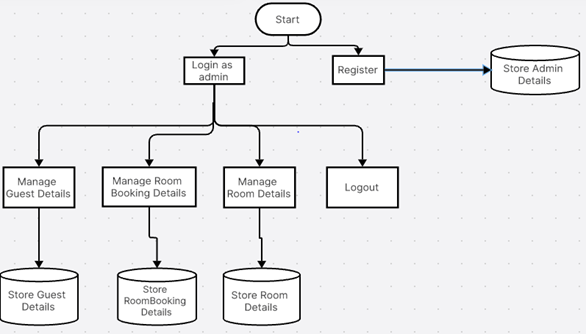

# Hotel-Management-System-using-Python
 This project is a Hotel Management System built using Python with a Tkinter GUI and MySQL Workbench for database management. It includes features for admin login and registration, managing customers, rooms, and generating reports.

**Features:**  
Admin Login: Secure login for administrators. 
Admin Registration: Registration system for new administrators. 
Main Menu: Easy navigation through various system functionalities. 
Customer Registration: Manage customer information and registration. 
Room Registration: Add and manage room details. 
Details: View details of customers, rooms, and bookings. 
Report Generation: Generate reports for occupancy, revenue, and other metrics.

**Flowchart:**  

**Technologies Used:**  
Programming Language: Python  
GUI Library: Tkinter 
Database Management: MySQL Workbench 

**Screenshot:**  

